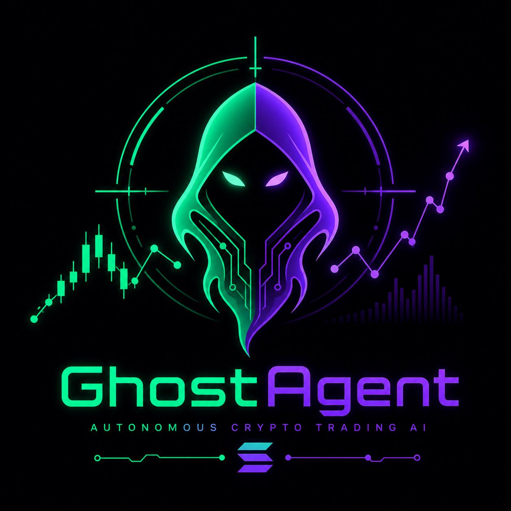

# GhostAgent: Autonomous Trading Protocol on Solana
**Colosseum Solana Frontier Hackathon Submission - 2026**
*Powered by Reis Architecture*

<p align="center">
  
</p>


An autonomous AI agent natively built to leverage Solana's unparalleled speed and imperceptible transaction costs. Managing risk without human intervention, identifying micro-arbitrage opportunities, and executing scalping strategies within milliseconds.

## 🌟 Why We Built on Solana
High-frequency automated trading requires sub-second execution and negligible fees. Traditional blockchains make this mathematically impossible. **Solana is the only ecosystem where GhostAgent can truly thrive.** Sub-second block times allow our agent's *TTP Ghost Engine* to react to sudden liquidity shifts, while fractions of a cent in fees mean micro-margins instantly become pure profit.

## 🚀 Core Technologies (Reis Architecture V3 Elite)

### 1. The Autonomous Agent (LLM & Algorithmic Router)
Unlike rigid programmatic bots, GhostAgent uses multi-timeframe confirmation (RSI cross-validation) combined with adaptive logic. It continuously parses DEX data to make enter/exit decisions dynamically.

### 2. Sub-Millisecond Execution (Solana Router)
Integrated directly via Jupiter Aggregator API blueprints, the agent bypasses slow UI layers. 
- **Latency Tolerance:** Failsafe triggers if execution estimation exceeds 400ms.
- **Slippage Control:** Dynamically adjusts accepted slippage based on Solana network congestion metrics.

### 3. TTP Ghost Engine & Dynamic DCA Risk Management
Derived from the elite-grade Reis Architecture, the agent features a proprietary layer-based Dollar Cost Averaging (DCA) and trailing stop system.
- **TTP (Trailing Take Profit):** Locks in micro-profits aggressively.
- **Ghost Layering:** Masks intent by slicing larger positions into lightning-fast micro-transactions across different Solana liquidity pools.

## 🏗️ Architecture Stack
```text
bot.py                 → Main asynchronous event loop & Agent Brain
strategy_router.py     → Signal generation & cross-validation engine
risk_manager.py        → Position sizing, dynamic DCA layers, P&L tracking
exchanges/             → Solana/Jupiter Network adapters (simulated for live demo)
web_ui.py              → Agentic monitoring dashboard providing real-time telemetry
```

## 🛠️ Quick Start (Developer Setup)

1. Clone this repository to your local environment.
2. Install Python dependencies:
   ```bash
   pip install -r requirements.txt
   ```
3. Run the Agent:
   ```bash
   python bot.py
   ```
4. Access the Real-Time Telemetry Dashboard:
   Navigate to `http://localhost:5566` in your browser.

## 🎯 Hackathon Scope Note
> **Note to Judges:** This repository contains the Hackathon build of `GhostAgent`. To protect commercial IP, certain proprietary tick tolerances and the exact enterprise-grade *TTP Ghost Engine* mathematical thresholds have been replaced with normalized variables. The framework elegantly demonstrates how AI agents can operate purely on-chain via the Solana ecosystem.
